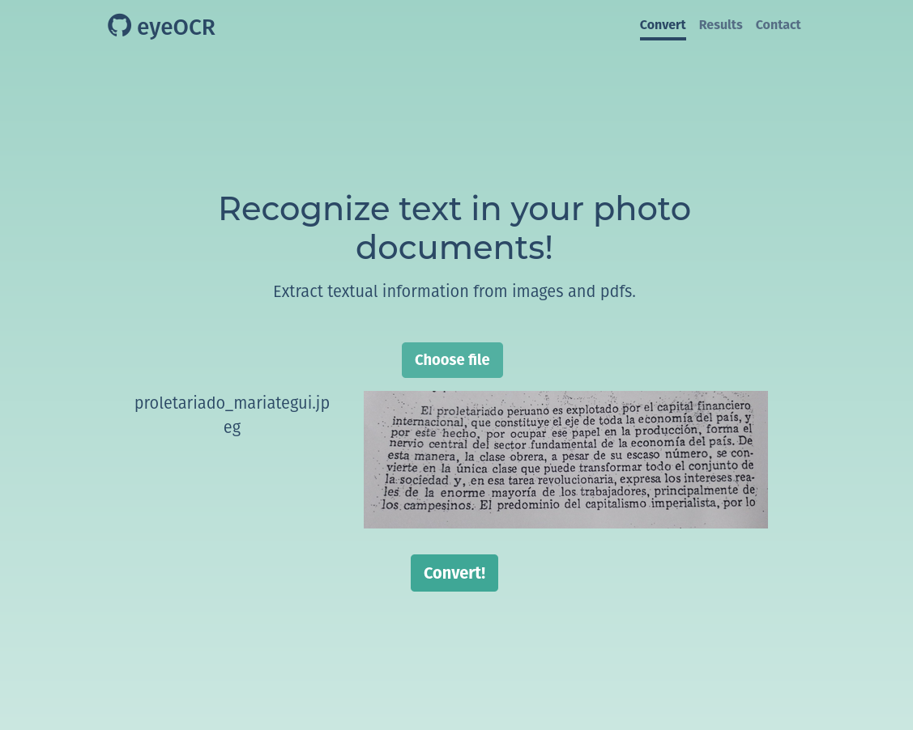
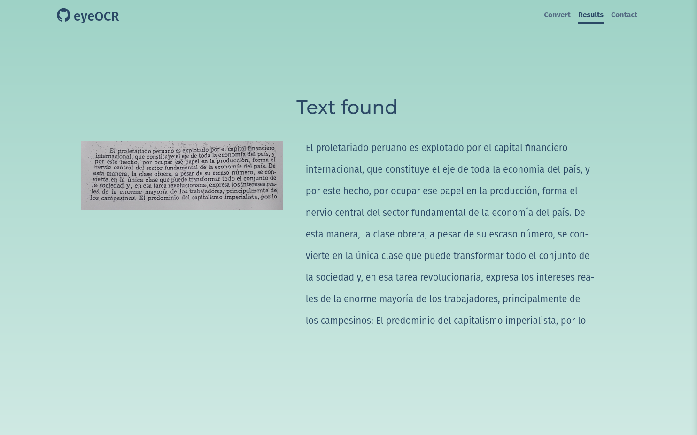

# eye OCR

This app takes and image or PDF file and extracts the text within. For this purpose, the Azure Computer Vision API is employed.

### Deployment

1. Clone this repository.

2. [Subscribe](https://azure.microsoft.com/en-us/free/cognitive-services/) to azure and  create a new Azure CV resource [here](https://portal.azure.com/#create/Microsoft.CognitiveServicesComputerVision).

3. Copy the key and endpoint of the resource. Add  to the root a file named 'authentication' in the following manner:

   ```
   key API
   endpoint API
   ```

4. Initialize an local git repository, and make a new commit.

   ```bash
   git init
   git add .
   git commit -m "version deployed to heroku"
   ```

5. Install Heroku CLI

   ```bash
   npm install -g heroku
   heroku --version
   ```

6. Deploy with Heroku.

   ```bash
   heroku login #login in new window
   
   #create remote app
   heroku create -a ocr_example
   
   #upload app to remote heroku
   git push heroku master
   
   #open the app
   heroku open
   ```

   

### Screenshots




### Live

- [Solution URL](https://talavera-ocr.herokuapp.com/)


### Built with

- Node js
- Express, ejs and multer modules
- Semantic HTML5 markup
- CSS and SASS
- Bootstrap

### Author

- Linkedin - [E. Campos](https://www.linkedin.com/in/edwin-edmar-campos-alarcon/)
